# 🌍 Atlas Oracle

**Atlas Oracle** is a premium location-intelligence application that transforms raw geographic coordinates into grounded, structured business analysis. 

Designed for urban planners, real estate developers, and entrepreneurs, it replaces gut feeling with data-driven feasibility studies. It combines real-time satellite/POI data with Google Gemini's reasoning capabilities to generate startup concepts, cost estimates, and risk assessments for any location on Earth.

## ✨ Key Features

*   **📍 Precision Context**: Fetches real-time weather, elevation, and Points of Interest (POIs) using OpenStreetMap and Open-Meteo.
*   **🧠 AI-Powered Analysis**: Uses **Google Gemini 3.0 Flash** with Google Search Grounding to reason over the data, identifying specific business gaps and opportunities.
*   **💡 Concrete Opportunities**: Goes beyond generic advice by generating specific project concepts (e.g., "The Harbor Roast Lab") with estimated startup costs and rationale.
*   **📄 Professional Reports**: Generates detailed PDF feasibility briefs client-side.
*   **️🗣️ Voice Integration**: Features an interactive Voice Agent (via **ElevenLabs**) that holds full context of the location analysis for Q&A.
*   **🛡️ Resilience**: Implements intelligent fallbacks for public APIs (e.g., rotating Overpass servers) to ensure uptime.

---

## 🏗️ Architecture

Atlas Oracle runs entirely in the browser using ES Modules and React. It acts as an orchestrator between raw data providers and the Reasoning Engine.

```mermaid
graph TD
    User([👤 User]) -->|Selects Location| UI[💻 React UI / Map]
    
    subgraph "Data Acquisition Layer"
        UI -->|Fetch| GeoService[Geo Data Service]
        GeoService -->|Get POIs| OSM[🗺️ Overpass API OSM]
        GeoService -->|Reverse Geocode| Nom[📍 Nominatim]
        GeoService -->|Weather/Elev| Meteo[🌤️ Open-Meteo]
    end

    subgraph "Reasoning Layer"
        GeoService -->|Normalized Context| GeminiService[Gemini Service]
        GeminiService -->|Prompt + Data| GenAI[⚡ Google Gemini API]
        GenAI -->|Grounding| Search[🔍 Google Search]
    end

    subgraph "Output Layer"
        GenAI -->|Structured JSON| UI
        UI -->|Generate| PDF[📄 jsPDF Engine]
        UI -->|Context Injection| Voice[🗣️ ElevenLabs Agent]
    end
```



## 🚀 How It Works

The application follows a strict four-step pipeline when a user clicks “Analyze Location”:

### 1. Data Aggregation (The “Senses”)

The app queries multiple public APIs in parallel:

- **Overpass API (OSM)**: Scans the selected radius (1km-5km) for specific node types: `amenity`, `office`, `shop`, `highway`, and `landuse`. It uses a round-robin fallback strategy across German, French, and Russian mirror servers to handle rate limits.
- **Nominatim**: Provides administrative context (Neighborhood, City, Zoning).
- **Open-Meteo**: Fetches current weather code and precise elevation data.

### 2. Context Normalization

Raw JSON data is cleaned and condensed into a `Context` object. This removes noise (like specific node IDs) and formats the data for token-efficient LLM consumption.

### 3. Reasoning (The “Brain”)

The normalized context is sent to **Google Gemini** with a system prompt that enforces:

- **Strict JSON Output**: The model must return a specific schema containing arrays for risks, opportunities, and evidence.
- **Search Grounding**: The model is instructed to use Google Search to verify local news or development plans that aren’t visible in the raw OSM data.
- **Creative Extrapolation**: The model invents plausible business names and calculates rough startup costs based on the identified economic tier of the location.

### 4. Presentation & Interaction

- **Visual**: Results are rendered into “Cards” for quick reading.
- **PDF**: A report is generated programmatically using the analysis data.
- **Voice**: The structured analysis (Concept names, Costs, Risks) is injected as dynamic variables into an ElevenLabs Conversational AI session, allowing the user to “talk” to the location advisor.

-----

## 🛠️ Technical Stack

- **Frontend**: React 19, Tailwind CSS (No build step, served via ES Modules/ImportMap).
- **Maps**: Leaflet & React-Leaflet.
- **AI**: `@google/genai` SDK.
- **Voice**: `@elevenlabs/react` SDK.
- **PDF**: `jspdf`.

## 💻 Setup & Usage

### Easiest setup Remix the app in Google AI Studio Build

link to app: <https://ai.studio/apps/drive/165J3M0kKY1EbD0OHKJ7G_Xju8-2Iz9bd?fullscreenApplet=true>

This project uses a “No-Build” architecture. There is no `npm install` required for the application logic itself, as dependencies are loaded via CDN in `index.html`.

1. **Clone the repository**:
   
   ```bash
   git clone https://github.com/your-username/atlas-oracle.git
   ```
1. **Environment Variables**:
   You need a Google Gemini API Key. Since this is a client-side demo, you must serve the file in an environment where `process.env.API_KEY` is replaced, or strictly for local dev, you can hardcode it (not recommended for production).
   
   *Note: The ElevenLabs Agent ID is configured in `AtlasOracleCallModal.tsx`.* copy the elevenlabs_prompt.md and create a new agent inside the dashboard with the prompt, copy the agent id and replace it in the modal.
   
1. **Run Locally**:
   You can use any static file server.
   
   ```bash
   # Using python
   python3 -m http.server 8080
   
   # Using node http-server
   npx http-server .
   ```
1. **Open in Browser**:
   Navigate to `http://localhost:8080`.

## ⚠️ Data Constraints

- **Overpass API**: Public instances have strict rate limits. If the analysis hangs, it is usually waiting for a slot on the OSM server. The app handles `504` and `429` errors by trying alternative servers.
- **Cost Estimates**: Financial data generated by the AI are rough estimates based on general market data and should not be treated as financial advice.

## 📄 License

MIT License.

```
**Changes made:**
1. Removed the extra space before "Open-Meteo" in the Mermaid diagram (changed `Meteo[ Open-Meteo]` to `Meteo[🌤️ Open-Meteo]`)
2. Removed parentheses from the OSM node label (changed `OSM[🗺️ Overpass API (OSM)]` to `OSM[🗺️ Overpass API OSM]`) as parentheses can sometimes cause parsing issues
3. Fixed a typo in the Setup section ("apo" → "app")

The diagram should now render correctly on GitHub!​​​​​​​​​​​​​​​​
```
